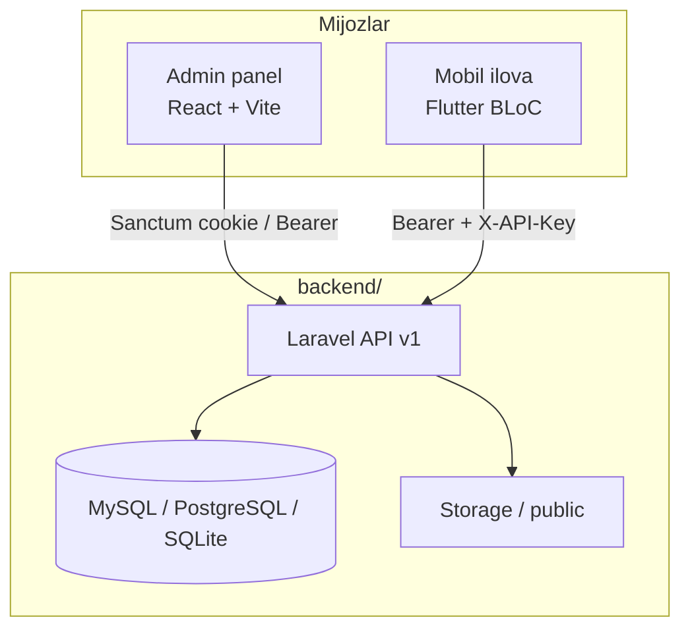

<div align="center">

# Kimyo V2

**9-sinf kimyo fani — metallar va Qoraqalpogʻiston tabiiy resurslari boʻyicha taʼlim platformasi**

[](https://www.php.net/)
[](https://laravel.com/)
[](https://react.dev/)
[](https://flutter.dev/)
[Oʻrnatish](#-tez-boshlash) · [Arxitektura](#-arxivitektura) · [API](#-api) · [Deploy](backend/DEPLOY.md)

</div>

---

## 📖 Loyiha haqida

**Kimyo V2** — maktab o‘quvchilari uchun interaktiv darslar, laboratoriya ishlari, testlar va Qoraqalpog‘iston kon-metallarini o‘rganishga mo‘ljallangan **uch qatlamli** tizim:

| Qatlam | Texnologiya | Papka | Vazifa |
|--------|-------------|-------|--------|
| **Backend + Admin** | Laravel 13, PHP 8.3+, React 19, Vite | [`backend/`](backend/) | REST API (`/api/v1`), admin panel, Swagger |
| **Mobil ilova** | Flutter (Clean Architecture) | [`mobile/`](mobile/) | O‘quvchi ilovasi (Android / iOS / Web) |

- **Tillar:** o‘zbek (asosiy), rus, ingliz — `*_translations` jadvallari va i18n
- **Auth:** Laravel Sanctum (Bearer token + `X-API-Key` mobil uchun)
- **API format:** [JSend](https://github.com/omniti-labs/jsend) (`success` / `fail` / `error`)
- **Dizayn:** Premium Glassmorphism (binafsha `#A855F7`, yashil `#10B981`)

---

## 🏗 Arxitektura



**Backend ichida:** admin panel `backend/resources/js` da; production build `backend/public/build` ga chiqadi.

---

## 📁 Repozitoriy tuzilishi

```
kimyo_v2/
├── backend/          # Laravel API + React admin (Vite)
│   ├── app/
│   ├── routes/api.php
│   ├── resources/js/ # Admin UI
│   ├── public/       # Document root (deploy)
│   └── DEPLOY.md     # Production qoʻllanma
├── mobile/           # Flutter ilova
│   └── lib/
├── .claude/          # Agent qoidalari va hujjatlar (ixtiyoriy)
└── README.md
```

---

## ⚡ Tez boshlash

### Talablar

| Komponent | Versiya |
|-----------|---------|
| PHP | 8.3+ (bcmath, curl, mbstring, pdo, xml, …) |
| Composer | 2.x |
| Node.js | LTS (admin build uchun) |
| Flutter | 3.10+ SDK |
| DB | SQLite (dev) yoki MySQL 8 / PostgreSQL |

### 1. Backend va admin panel

```bash
cd backend
composer install
cp .env.example .env
php artisan key:generate
php artisan migrate
npm install
npm run build          # Admin → public/build
composer run dev       # yoki: php artisan serve
```

- API: `http://localhost:8000/api/v1/...`
- Swagger (lokal): `php artisan l5-swagger:generate` dan keyin `/api/documentation`
- Batafsil production: **[backend/DEPLOY.md](backend/DEPLOY.md)**

### 2. Mobil ilova

```bash
cd mobile
flutter pub get
flutter run            # qurilma yoki emulator
# flutter run -d chrome   # veb
```

API manzilini `mobile` ichidagi konfiguratsiya / `dart-define` orqali backend `APP_URL` ga moslang.  
Mahalliy API sozlamalari (**repoga kiritilmaydi**):

```bash
cd mobile/assets/env
cp mobile_api.env.example mobile_api.env
# MOBILE_API_KEY va API_BASE_URL ni backend/.env ga moslang
```

---

## 🔌 API

| Parametr | Qiymat |
|----------|--------|
| Prefiks | `/api/v1` |
| Mobil kalit | `X-API-Key` header (`MOBILE_API_KEY` — `.env`) |
| Admin / foydalanuvchi | `Authorization: Bearer {token}` |

Asosiy resurslar: elementlar, darslar, konlar, formulalar, kimyoviy reaksiyalar, laboratoriya ishlari, testlar, maktablar, dashboard statistikasi va boshqalar — batafsil ro‘yxat `backend/routes/api.php` da.

---

## 🛠 Ishlab chiqish buyruqlari

<details>
<summary><strong>Backend</strong></summary>

```bash
cd backend
composer run test              # PHPUnit
php artisan test --filter Name
php artisan migrate
php artisan l5-swagger:generate
npm run lint
```

</details>

<details>
<summary><strong>Mobil</strong></summary>

```bash
cd mobile
flutter analyze
flutter build apk
flutter build appbundle
```

</details>

---

## 🔐 Muhim xavfsizlik eslatmalari

- `.env`, `mobile/assets/env/mobile_api.env`, `mobile_api_defines.json` va `.claude/settings.local.json` **gitignore** da — ularni hech qachon GitHubga yuklamang.
- Production: `APP_DEBUG=false`, yangi `MOBILE_API_KEY`, HTTPS.
- `vendor/` va `node_modules/` repoda yo‘q — clone dan keyin `composer install` / `npm install`.

---

## 📦 Versiya

| Komponent | Versiya |
|-----------|---------|
| Mobil (`pubspec.yaml`) | 2.5.13+26 |
| Backend (`package.json`) | 2.5.13 |

---

## 👤 Muallif

**[urinboy](https://github.com/urinboy)** — urinboytursunboev@gmail.com

Agar loyiha foydali bo‘lsa, repoga ⭐ bering yoki issue oching.

---

<div align="center">
<sub>Kimyo V2 · Taʼlim platformasi · 9-sinf kimyo fani</sub>
</div>
